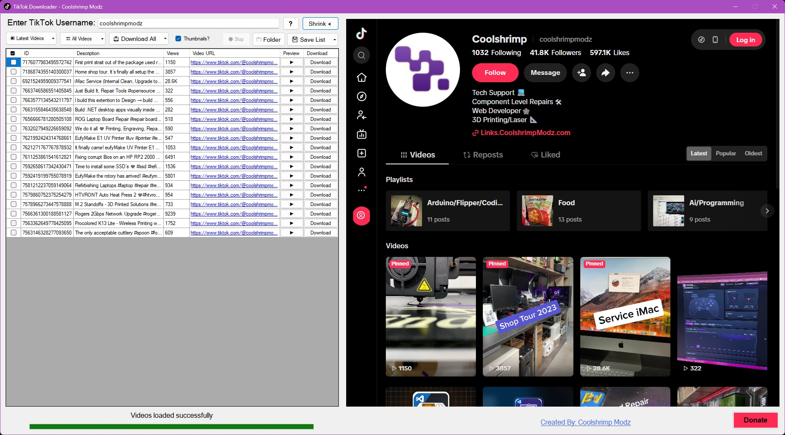
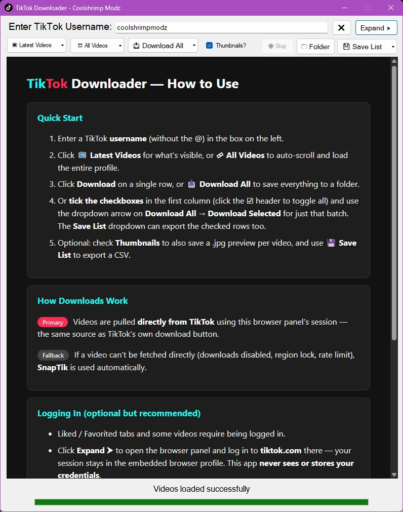

# TikTok Downloader

TikTok Downloader is a Windows desktop utility for bulk or single-video downloads from TikTok user profiles, liked videos, reposts, and favorites. It provides a friendly GUI with **auto-scroll** to load a user's entire feed, parses the video URLs, and downloads them — now **directly from TikTok** with SnapTik as an automatic fallback.

---

## Download

Grab the latest **single-file EXE** from the [Releases page](../../releases/latest) — no installer, no loose DLLs. Just make sure the requirements below are present (they ship with Windows 10/11).

---

## Features

- **Load User Videos**: Enter a TikTok username and instantly see their posted content.
- **Batch or Single Download**: Download all videos in bulk or pick individual videos to save.
- **Checkbox Selection**: Tick any videos in the list (click the ☑ header to toggle all) and download or export just that batch via the dropdown on **Download All** / **Save List**.
- **Native TikTok Downloads**: Grabs the direct video URL straight from TikTok's own page data (the same source as TikTok's built-in download button) — fast and reliable.
- **SnapTik Fallback**: If the direct TikTok download is unavailable (region-locked, download disabled, or rate-limited), the app automatically falls back to [SnapTik](https://snaptik.app).
- **Auto Scroll**: Automatically scroll to the bottom of a user's TikTok page to load all content.
- **Likes / Favorites / Reposts**: Retrieve liked, favorited, or reposted videos (if you're logged in inside the embedded browser).
- **CSV Export**: Export the collected video list to a CSV file.
- **Progress Tracking**: Real-time status and progress for scraping and downloads.
- **Tray Icon & Background Downloads**: Closing the window (X) hides the app to the system tray while downloads keep running (minimize goes to the taskbar as usual; quit via the tray menu's Exit). The tray tooltip and menu show live progress (e.g. "Downloading 20/300"), with quick actions to show/hide the window, open the download folder, stop downloads, or exit.
- **Login Stays in the Browser**: Logging in to TikTok happens inside the embedded WebView2 browser only — credentials and cookies live in the browser profile, never in the app.
- **Thumbnail Option**: Download thumbnails alongside the videos for easy reference.

---

## Requirements

- **Windows 10 or later**
- **.NET Framework 4.8** (preinstalled on Windows 10/11)
- **[WebView2 Runtime](https://developer.microsoft.com/en-us/microsoft-edge/webview2/)** (preinstalled on Windows 11; the Evergreen runtime installer covers Windows 10)
- A stable internet connection

---

## Usage

A built-in **How to Use guide** opens over the list on every launch (toggle it anytime with the ❓ button, or from the tray menu):

1. **Enter TikTok Username**
   - Type the username in the text field (e.g. `username` without the `@`).

2. **Choose Video Scope**
   - Click **Latest Videos** to load visible posts without autoscroll.
   - Click **All Videos** (or use the drop-down) to auto-scroll and load the entire feed (including reposts, liked, or favorited videos if you're logged in).

3. **Load Videos**
   - Wait for the progress bar to reach 100%. The grid will list each found video.

4. **Download Videos**
   - **Single Download**: Click the **Download** button in the row you want.
   - **Download All**: Use the "Download All" button to save every video in the list to a selected folder. Already-downloaded videos are skipped, and rows turn green on success (red if a video could not be retrieved).
   - **Download Selected**: Tick the checkboxes in the first column (any order — click the ☑ header to check/uncheck all), then use the dropdown arrow on **Download All** → **Download Selected**.

5. **Optional CSV Export**
   - Use the "Save List" button to export the entire video list (IDs, descriptions, stats, URLs) to a CSV file, or its dropdown → **Save Selected** for just the checked rows.

---

## How Downloads Work

1. **TikTok direct (primary)** — the app opens the video page in the embedded WebView2 browser, reads the direct media URL from TikTok's page data, and downloads it using your browser session.
2. **SnapTik (fallback)** — only if the direct method fails, the app submits the link to SnapTik and retrieves the download URL from there (typically a no-watermark version).

The status bar always shows which method was used.

---

## Building from Source

1. Clone the repo and open `TikTok Downloader.sln` in Visual Studio 2019 or newer.
2. Restore NuGet packages (`HtmlAgilityPack`, `Microsoft.Web.WebView2`, `Fody`, `Costura.Fody`). The `SplitButton` control ships in `lib/`.
3. Build — the project targets .NET Framework 4.8.

The Release build produces a **single self-contained EXE**: all managed dependencies and the native WebView2 loader are embedded via Costura.Fody, so `TikTok Downloader.exe` can be distributed on its own. Only the .NET Framework 4.8 and the WebView2 Runtime need to be present on the target machine (both ship with Windows 10/11).

---

## Troubleshooting

- **WebView2 Not Initialized**: Install the [WebView2 Runtime](https://developer.microsoft.com/en-us/microsoft-edge/webview2/) or ensure it's up to date.
- **No Videos Found**: Double-check the username spelling or ensure you have an active internet connection.
- **Login-Required Tabs Not Working**: If you're not logged in to TikTok in the embedded browser, "liked" or "favorited" videos may not load.
- **Downloads Fall Back to SnapTik Often**: Some videos have downloads disabled by the creator or are region-restricted; the fallback handles these automatically.
- **Stuck or Slow**: Large accounts or slow internet might require more time. Check the progress bar or status for updates. Page loads now time out after 30 seconds instead of hanging.

---

## Version History

### v6
- **Added**: Native TikTok downloads — direct media URL pulled from TikTok's own page data, used as the primary method.
- **Added**: System tray icon with live download status ("Downloading 20/300"), show/hide, open-folder, stop, and exit actions. Minimizing hides the window to the tray while downloads continue.
- **Added**: Built-in "How to Use" guide shown in the browser panel (also available from the tray menu), plus tooltips on all controls.
- **Changed**: The app now starts compact with the browser panel hidden; first launch starts expanded with the guide visible.
- **Added**: Checkbox column for batch selection — download or CSV-export only the checked videos via new split-button dropdowns on Download All and Save List; click the ☑ header to toggle all.
- **Changed**: SnapTik is now an automatic fallback instead of the primary downloader.
- **Fixed**: SnapTik link submission (the URL was never registered by SnapTik's page, so downloads silently failed).
- **Fixed**: App no longer freezes when a page fails to load — navigation now has a 30-second timeout.
- **Improved**: Failed videos are marked red in bulk downloads instead of being skipped silently.

### v5
- **Improved**: Stability of auto-scroll for large accounts.
- **Optimized**: Performance for multi-video downloads.
- **Added**: Reposts / Liked / Favorited content retrieval (logged in).

### v4
- Changed download host to SnapTik.
- **Enhanced**: Improved SnapTik integration and progress tracking.
- **Fixed**: Minor bug with CSV export not including stats properly.
- **Added**: Thumbnail downloads (optional).

### v3
- **Initial Release**
  - Load user videos (posted content).
  - Single or all-video downloads.
  - CSV export of the video list.
  - Auto scroll to load more videos.

---

## Donate

If you'd like to support the development of tools like this, consider a donation:
[**Support Me**](https://links.coolshrimpmodz.com)

---

Enjoy downloading TikTok videos! If you find a bug or have suggestions, feel free to open an [issue](../../issues).
